# Codeflash vs Ringtail

This document compares Ringtail's current architecture with the public architecture and workflows described by [Codeflash](https://www.codeflash.ai), based on:

- Codeflash public docs:
  - [How Codeflash Works](https://docs.codeflash.ai/codeflash-concepts/how-codeflash-works)
  - [How Codeflash Measures Code Runtime](https://docs.codeflash.ai/codeflash-concepts/benchmarking)
  - [Trace & Optimize E2E Workflows](https://docs.codeflash.ai/optimizing-with-codeflash/trace-and-optimize)
- Codeflash open-source repository layout and representative modules such as:
  - `codeflash/discovery/*`
  - `codeflash/optimization/optimizer.py`
  - `codeflash/verification/*`
  - `codeflash/benchmarking/*`
  - `codeflash/tracer.py`
- Ringtail current implementation in:
  - [`ARCHITECTURE.md`](ARCHITECTURE.md)
  - [`src/core/optimization_loop.jac`](src/core/optimization_loop.jac)

The goal is not to reverse-engineer Codeflash internals. The goal is to understand what their public architecture suggests, what Ringtail can learn from it, and where Ringtail should differentiate.

## Executive Summary

Codeflash appears to be stronger than Ringtail today in the part of the pipeline that happens before optimization: discovering candidate functions in a real codebase, mapping them to tests, tracing real executions, ranking hotspots, and packaging results into developer-friendly workflows like PRs and GitHub Actions.

Ringtail is stronger today in the part of the pipeline that happens during and after optimization evaluation: explicit baseline profiling, structured optimization loops, property-based equivalence checks, complexity tracking, and statistical comparison of before/after results.

The clearest strategic conclusion is:

- Ringtail should borrow Codeflash's repo-native workflow ideas.
- Ringtail should keep doubling down on rigorous verification, research-grade benchmarking, and multi-agent optimization strategy.

That would position Ringtail less as "another optimization bot" and more as a verifiable optimization research harness that can eventually outperform simpler generate-and-verify systems.

## What Codeflash Seems To Be

From its docs and repository structure, Codeflash is a repo-native code optimizer with this rough pipeline:

```mermaid
flowchart LR
repoCode[RepoCode] --> discovery[DiscoveryAndTestMapping]
discovery --> tracing[TracingAndReplayInputs]
tracing --> ranking[HotspotRanking]
ranking --> candidateGen[CandidateGeneration]
candidateGen --> verification[BehaviorVerification]
verification --> benchmark[BenchmarkingAndSelection]
benchmark --> prFlow[PRCreationAndAutomation]
```

### 1. Discovery first

Codeflash does not appear to start from a manually packaged function input. Instead, it starts from a repository and discovers:

- functions that are eligible for optimization
- tests that directly call those functions
- tests that indirectly exercise them through tracing

This is reflected both in the docs and in modules like:

- `codeflash/discovery/functions_to_optimize.py`
- `codeflash/discovery/discover_unit_tests.py`

This is a major product advantage because it reduces user setup friction.

### 2. Tracing and replay are core

The most distinctive part of Codeflash's public workflow is the tracer:

- it traces scripts or test runs
- captures real function inputs
- generates replay tests from those inputs
- uses replay tests for both correctness and performance checks

That is a strong bridge between synthetic benchmarking and real-world behavior. Their docs make this a first-class feature, not an optional research tool.

### 3. Ranking matters

Codeflash is not just trying to optimize arbitrary functions. It also ranks them using profiling information and "addressable time" style heuristics. That means it tries to optimize functions that matter most to end-to-end runtime, not just whichever function the user happened to point at.

This is important because optimization systems lose credibility if they produce low-impact wins.

### 4. Verification is broader than return-value equality

Publicly, Codeflash says it verifies:

- return values
- exception types
- input mutation behavior
- line coverage sufficiency

Its verification code also suggests it handles complicated Python object comparisons. That is broader than simple output matching.

### 5. Benchmarking is practical and noise-aware

Codeflash's benchmarking philosophy is pragmatic:

- run many times
- use multiple inputs
- keep the best observed timing per input
- sum those minima
- require a material speedup threshold before declaring success

This is a very product-oriented method for noisy local and CI machines.

### 6. Workflow integration is part of the architecture

Codeflash is not only an optimizer engine. Its architecture includes:

- CLI flows
- GitHub Action integration
- PR generation
- repo-wide optimization modes like `codeflash --all`

That makes it feel like a developer tool, not just a research prototype.

## What Ringtail Is Today

Ringtail's current architecture is centered on a function-level optimization loop.

The core flow, as implemented in [`src/core/optimization_loop.jac`](src/core/optimization_loop.jac), is approximately:

```mermaid
flowchart LR
functionInput[FunctionInput] --> parse[ParseFunction]
parse --> baseline[BaselineProfileAndComplexity]
baseline --> plan[OptimizerAgentPlan]
plan --> rewrite[GenerateCandidateCode]
rewrite --> tests[UnitTestsAndCoverage]
tests --> property[PropertyTestsAgainstOriginal]
property --> reprofile[ProfileCandidate]
reprofile --> compare[MetricComparisonAndSignificance]
compare --> stop[StopOrIterate]
```

### Current strengths

- Explicit optimization loop orchestration.
- Baseline profiling before optimization.
- Property-based tests using Hypothesis against the original implementation.
- Complexity analysis and coverage tracking.
- Statistical before/after comparison rather than single-run timing.
- Clean separation between planning, code generation, testing, property testing, and profiling.
- Existing benchmark harnesses for LeetCode-style tasks.

### Current limitations

- Optimization starts from a manually constructed `FunctionInput`, not a discovered repo target.
- There is effectively one optimizer agent today, not yet a true multi-agent system.
- The heuristic optimizer is mostly a stub when no LLM is used.
- Property testing relies heavily on type annotations.
- Benchmarking and repo-wide workflows are adjacent to the main loop rather than fully integrated into it.
- CLI and broader product interfaces are still limited.

## Direct Comparison

### Where Codeflash is ahead

#### Repo-native user experience

Codeflash is much better aligned with how developers actually work in repositories:

- scan repo
- find candidate functions
- map tests
- trace a workflow
- optimize high-value functions
- ship a PR

Ringtail currently expects the user or caller to assemble the optimization target manually.

#### Real-input validation

Replay tests are a strong idea because they use actual observed behavior rather than only user-specified test cases or inferred property-test inputs.

Ringtail currently has good synthetic validation, but weaker real-workload capture.

#### Target selection

Codeflash appears to do better at choosing what to optimize. That matters because a system that optimizes the wrong function is "correct" but still not useful.

Ringtail can measure improvements well, but it does not yet have a strong repo-level targeting layer.

#### Product packaging

Codeflash has already invested in:

- CLI workflows
- GitHub automation
- PR generation
- end-to-end "trace and optimize" workflows

Ringtail is still more of a harness/core engine than a complete developer product.

### Where Ringtail is ahead or can plausibly lead

#### Stronger experimental rigor

Ringtail's current design already emphasizes:

- baseline measurement
- repeated profiling
- significance-style comparison
- property-based correctness gates

This is a better foundation for research-grade claims than a simpler "best of N" heuristic alone.

#### Better optimization-science story

Ringtail's project goal is not just to optimize code. It is to compare optimization approaches, especially multi-agent vs single-agent strategies, with verifiable metrics.

That is a more defensible and differentiated mission than "AI tool that makes code faster."

#### Better future path for multi-agent orchestration

Codeflash's public architecture looks like a robust single pipeline with a backend optimizer. Ringtail can differentiate by explicitly modeling specialized agents for:

- hotspot analysis
- candidate generation
- correctness review
- benchmark design
- cost control
- convergence decisions

That is a more ambitious research and systems direction.

#### Property testing as a first-class safety net

Codeflash emphasizes generated tests and replay tests. Ringtail already has a place for property-based testing directly in the loop. That is valuable, especially for algorithmic code where invariants matter more than a finite test set.

## What Ringtail Should Borrow

These are the highest-leverage ideas Ringtail should adopt from Codeflash.

### 1. Add repo-native discovery before optimization

Ringtail should grow a front-end layer that:

- scans source files
- discovers optimizable functions
- maps tests to functions
- constructs `FunctionInput` automatically

This would make the existing optimization loop much more usable without changing its core logic.

Best fit in Ringtail:

- Keep the current loop in [`src/core/optimization_loop.jac`](src/core/optimization_loop.jac)
- Add a new discovery subsystem that feeds it
- Treat `FunctionInput` as the internal normalized format, not the external UX

### 2. Add tracing and replay tests

This is probably the single highest-value idea to adopt.

A Ringtail tracer should:

- run a script or test suite
- record function calls and representative inputs
- generate replay-based tests/benchmarks
- feed those into optimization, correctness checking, and profiling

This would dramatically improve:

- target selection
- correctness confidence
- benchmark realism

### 3. Add hotspot ranking

Before running the expensive optimization loop, Ringtail should rank candidate functions by likely payoff.

Possible ranking signals:

- self time
- cumulative time
- call frequency
- addressable time
- memory pressure
- repeated allocations

This will help satisfy the project's cost constraint by avoiding low-value LLM runs.

### 4. Expand equivalence checking

Ringtail currently checks generated tests plus property-based output equivalence. It should add richer behavior comparison for replay-based verification:

- same exception class
- same mutation to mutable inputs
- same observable state changes
- same stdout/stderr when relevant

This is especially important if Ringtail moves beyond pure algorithmic functions.

### 5. Move from one candidate to candidate sets

Codeflash publicly talks about generating several optimization candidates and selecting the best one after verification and benchmarking.

Ringtail should do the same. Instead of:

- one plan
- one rewrite
- one evaluation

it should move toward:

- multiple candidate strategies
- shared correctness filters
- benchmark-driven ranking
- selection of the best passing candidate

This fits Ringtail's multi-agent research goals very well.

### 6. Build repo-facing interfaces earlier

A strong architecture is not enough if the tool is hard to run. Ringtail should prioritize:

- a CLI that optimizes a file, function, or trace
- a "discover and rank" mode
- a "trace and optimize" mode
- machine-readable result artifacts

PR automation can come later, but repo-native workflows should come sooner.

## How Ringtail Should Differentiate

Copying Codeflash too closely would make Ringtail look derivative. The better move is to adopt the strongest workflow ideas while differentiating on rigor, science, and control.

### 1. Be the most verifiable optimizer

Ringtail should position itself around trust and evidence:

- unit tests
- coverage
- property tests
- replay tests
- significance-aware profiling
- clear termination reasons
- reproducible logs

If Codeflash is the "fast shipping" tool, Ringtail can be the "trustworthy optimization lab."

### 2. Be the best system for optimization research

Ringtail should lean into its stated purpose:

- compare agent strategies
- compare models
- compare prompt or planning policies
- compare optimization passes
- compare benchmark selection methods

This can become a serious advantage if results are structured, logged, and reproducible.

### 3. Make multi-agent optimization real

A differentiated Ringtail architecture could use specialized agents instead of one general optimizer:

- `analyzer` agent to inspect bottlenecks and constraints
- `benchmark_designer` agent to propose missing tests and stress inputs
- `candidate_generator` agent to propose multiple optimization directions
- `reviewer` agent to reject risky rewrites
- `judge` agent to weigh speedup, readability, and confidence

That would make Ringtail distinct both technically and narratively.

### 4. Lead on cost-aware optimization

Your `AGENTS.md` already makes API cost a first-class concern. That can be a real differentiator if it becomes architectural rather than aspirational.

Examples:

- cache prior analyses and failed candidates
- rank targets before any LLM call
- stop early on low-upside functions
- use cheaper models for initial candidate generation
- reuse traces, tests, and profiles across runs

Code optimization tools can easily become expensive. Building cost control into the core loop is a practical differentiator.

### 5. Emphasize optimization provenance and explainability

Ringtail should preserve a detailed record of:

- why a function was selected
- what bottleneck was observed
- what hypotheses the agent had
- which candidates were rejected and why
- what evidence justified the accepted optimization

That makes the tool more useful for research, debugging, and human trust.

### 6. Focus on benchmarkable domains first

Codeflash is broad. Ringtail can win by being excellent in narrower areas first:

- algorithmic problems
- performance-critical Python utilities
- numerical kernels
- backend hot paths with deterministic tests

In those domains, property tests and reproducible benchmarking are especially powerful.

## A Good Strategic Framing

One useful framing is:

- Codeflash optimizes code inside developer workflows.
- Ringtail should optimize optimization itself.

In other words, Codeflash is product-first. Ringtail can be methodology-first.

That does not mean Ringtail should ignore UX. It means the product should express a stronger core thesis:

- optimization should be measurable
- optimization should be explainable
- optimization should be reproducible
- optimization should be safe under multiple forms of verification
- optimization systems themselves should be compared scientifically

## Recommended Roadmap

### Phase 1: Borrow the best front-end ideas

Priority:

- repo/function discovery
- test mapping
- hotspot ranking
- trace capture
- replay tests

This closes Ringtail's biggest current gap without abandoning the current loop.

### Phase 2: Strengthen verification and selection

Priority:

- richer equivalence checking
- multiple candidate generation
- benchmark-based candidate ranking
- persisted artifacts for traces, tests, and rejected candidates

This turns Ringtail from a single-path optimizer into a better search system.

### Phase 3: Differentiate on research and multi-agent orchestration

Priority:

- specialized agent roles
- cost-aware orchestration
- controlled experiments across agent strategies
- benchmark suites with publishable metrics

This is where Ringtail can become genuinely different, not just feature-comparable.

## Concrete Near-Term Ideas For Ringtail

If the goal is to improve quickly, these are the best immediate bets:

1. Add a `discover_functions` + `discover_tests` subsystem that builds `FunctionInput` automatically.
2. Build a lightweight tracer that records concrete calls and emits replay tests for Python functions.
3. Let the optimizer loop evaluate multiple candidates per iteration and keep the best verified one.
4. Extend correctness checking to compare exceptions and mutable input effects, not just returned values.
5. Merge the benchmark harness more tightly with the optimization loop so "find, optimize, verify, benchmark" becomes one coherent pipeline.
6. Expose a repo-facing CLI mode before adding full GitHub automation.

## Final Take

Codeflash provides a very useful reference for what a practical optimization product looks like:

- repo-aware
- trace-aware
- benchmark-aware
- PR-aware

Ringtail should learn from that.

But Ringtail should not stop there. Its real opportunity is to become the stronger system for trustworthy, measurable, and research-grade optimization. The best version of Ringtail is not "open-source Codeflash in Jac." The best version is a system that uses repo-native workflows like Codeflash, but surpasses it in verification rigor, experimental design, multi-agent orchestration, and cost-aware optimization policy.
